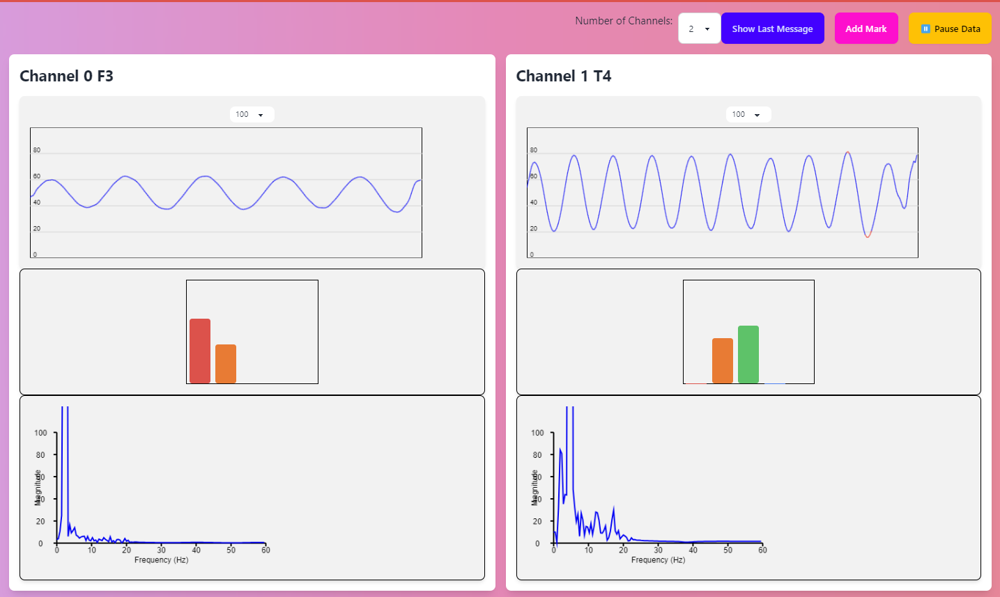

# Brainwave
An electroencephalography (EEG) data processing and visualisation tool, using Node & Typescript.

Connects to your EEG device, streams the EEG data, performs some processing, and outputs the results to websocket clients for visualisation.

That visualiser (not currently included in this repo) could display something like the following (dummy synthetic data is used here):


The processing includes:
* Bandpass & bandstop filters to filter to interesting brainwave frequencies and remove e.g. 50Hz/60Hz electrical noise.
* FFT analysis.
* Band power analysis (delta, theta, alpha, beta, gamma).
* A cheap blink test that just looks for high amplitude signals, so that epoch can be discarded.

Any board supported by the Brainflow library is supported, including OpenBCI Cyton.

## Running
Clone the project then:
```
cd server
npm install

# With synthetic data
npx ts-node index.ts --boardId -1 --channels F3 T4

# With OpenBCI Cyton 
npx ts-node index.ts --boardId 0 --channels F3 T4

# With Neurosity Crown 
npx ts-node index.ts --boardId 23 --channels C3 C4 CP3 CP4 F5 F6 PO3 PO4
```

Replace with your Brainflow board id (using the synthetic board in the example above), and the names of the EEG channels.

